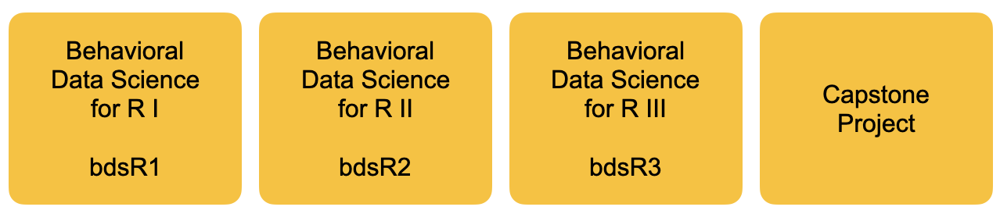

```{r setup, include=FALSE}
options(htmltools.dir.version = FALSE)
```

```{r xaringan-themer, include = FALSE}
library(xaringanthemer)
style_mono_accent(
    base_color = "#0F4C81", # DAPR1
  header_color = "#000000",
  header_font_google = google_font("Source Sans Pro"),
  header_font_weight = 400,
  text_font_google = google_font("Source Sans Pro", "400", "400i", "600", "600i"),
  code_font_google = google_font("Source Code Pro")
)

library(tidyverse)
```


```{r welcome, echo=FALSE}
cohort <- 2022
team <- c("Nick", "Derek", "ETC")
lecture_hours <- 1
lab_hours <- 2
```

# Developing the CBI Research Cluster

---

```{r, out.width = "1000px", echo=FALSE}

```

---

# Motivation and Program Needs

+ To grow enrollment and help with recruitment in CBI, we need a new core curriculum that emphasizes practice-based application of data science methods

--

+ We belief that all psychology students should develop data science skills in statistics and research methods

--

+ Program overall is in need of new electives for ground and online students

--

+ Near-term future will be marked by major shifts in job opportunities. Of the most in-demand skills are those that involve “analytical reasoning” and “scientific computing”

---

# What would make this program unique?

+ Develop a portfolio of 10-12 “mini-courses” (i.e., modules)

  + Each module will be targeted, covering 3-4 weeks worth of material on single core ideas

  + All modules will be designed around consistency; a similar pedagogy and structure built within Rmd notebooks

  + All modules will be self-contained allowing for self-paced learning

  + All modules are **composable**; they can be combined to create new semester-long elective courses

  + Introductory modules are integrable; they can be inserted into existing Quant I or II curriculum for supplementary learning 
  
  + We aim to make all modules as instructor-agnostic as possible; anyone with some subject matter expertise will be able to guide the course

  + We aim to make the modules as scalable as possible for online; low grading costs

---

# Composable: Data Analysis for Psychology in R Sequence of Courses

+ Data Analysis for Psychology in R I (dapR1)

  + Module: Working with data
  
  + Module: Probability & sampling
  
  + Module: Hypothesis testing
  
  + Module: Basic tests
  
+ Data Analysis for Psychology in R II (dapR2)

  + Modules: TBD
  
+ Data Analysis for Psychology in R III (dapR3)

  + Modules: TBD

---

# Consistent Structure 

+ Every lesson within each module will contain common elements:

+ Content: 

  + Lecture slide deck 
  
  + Lab notebook with exercises

+ Assessment: 

   + Quiz
   
   + ... 

---

# Path to Concentration (Behavioral Data Science)

```{r, echo=FALSE}

```

---

# Projected Timeline (Road Map)

---

# Projected Timeline (Year 1)

---
# Where does dapR1 fit for Spring 2023?

+ Need to figure out course schedule for initial piloting!

  + Online or ground? Both?

  + Enrollment caps
  
  + Option: We both teach a ground course, one focused on just undergrads (PSY 494) and one focused on just graduate students (PSY 598). Enrollment cap of 20 students for each section (40 students max)?
  
  + Option: We each teach a cross-listed UG/Grad course (PSY 494/598) but one in a ground format and another in an iCourse (online) format. Both will be 15 week courses. Enrollment cap of 20 students for each section (40 students max)?

---
# dapR 1: Aims

+ Build the core data and R skills.
    + And to do so at a slow and steady pace.
    + Dealing with data; tidying it, manipulating it, and transforming it; visualize it; and a bit of analyzing. 

+ Introduce some key statistical concepts.

+ To help students develop an effective approach to studying data analysis.

+ To integrate/supplement with previous statistics/methods courses. 

---
# dapR 1: Structure Deeper Dive
+ Considerations will need to be different if online or ground?

--

+ **Lectures**
  + Equivalent of ~1hr of live lecture, broken into shorter chunks
  + The chunks will be linked with tasks.

--

+ **Independent study labs**
  + Structured reading and exercises with R
  + Equivalent of ~2-3 hrs per week

--

+ **Supported by**
  + In person on-line office hours (see LEARN for times)
  + Discussion boards

???
+ Requires you to work steadily and consistently across the year. 
+ It builds, and it is hard to cram.
+ To help you build this study skills, course has a specific assessment structure.

---
# dapR 1: Assessment 
+ **Weekly quizzes** (20%)
  + 16 quizzes in total 
  + Quizzes 1 and 2 are practices.
  + The rest comprise your grade.
  + Mark is the average of your best 12/14 scores.

--

+ **Lab tests** (30%)
  + Test 1 is practice
  + Tests 2-4 count (10% each)

--

+ **Coursework report** (50%)
  + Organise some data, produce some plots, run and interpret some analysis.

???
Key point to make is the little and often principle


---
# Materials
+ All of your materials for each week will be within the weekly folders on LEARN.

--

+ It will contain:
  + A playlist of recordings
  + Slide decks
  + Links to lab material
  + Links to the weekly quizzes
  + Any comments or specific instructions for the week
  + Links to discussion boards
  + Reading (all freely available online)

--

+ The weekly folders will become available incrementally.

---
# dapR Team
+ Nicholas Duran
+ Derek Powell
+ Bryor Snefjella (Jan 2023)
+ Potentially new hire for August 2023
+ Need CAS (lots)

---
class: center, middle
# Ready for this?!
